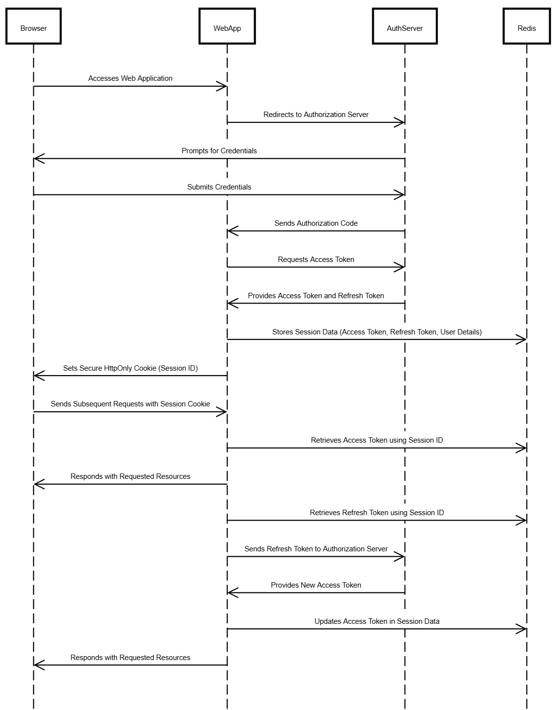

# Course Selection and Timetable Management System

## Roles:

- **HOD**
- **Timetable Coordinator**
- **Lecturers (Users)**

## Requirements

### Create users

```sql
  DROP TABLE IF EXISTS users;
```

```sql

CREATE TYPE role_enum AS ENUM ('HOD', 'Timetable Coordinator', 'Lecturer');

CREATE TABLE Users (
    user_id SERIAL PRIMARY KEY,
    uname VARCHAR(50) NOT NULL,
    email VARCHAR(255) UNIQUE NOT NULL,
    role role_enum NOT NULL,
    oauth_provider VARCHAR(50) NOT NULL,
    oauth_id VARCHAR(100) UNIQUE NOT NULL,
    seniority_year INTEGER NOT NULL,
    is_active BOOLEAN NOT NULL DEFAULT TRUE,
    created_at TIMESTAMP DEFAULT CURRENT_TIMESTAMP
);
```

```sql
-- show description
\d+ users
```

```sql
CREATE TABLE AcademicYears (
    year_id INTEGER PRIMARY KEY,
    academic_year VARCHAR(50) NOT NULL,
    created_by INTEGER NOT NULL,
    created_at TIMESTAMP DEFAULT CURRENT_TIMESTAMP,
    FOREIGN KEY (created_by) REFERENCES Users(user_id)
);
```

```sql
CREATE TABLE Batches (
    batch_id INTEGER PRIMARY KEY,
    year_id INTEGER NOT NULL,
    section VARCHAR(10) NOT NULL,
    noOfStudent INTEGER CHECK (noOfStudent >= 0) NOT NULL,
    created_by INTEGER NOT NULL,
    created_at TIMESTAMP DEFAULT CURRENT_TIMESTAMP,
    FOREIGN KEY (created_by) REFERENCES Users(user_id),
    FOREIGN KEY (year_id) REFERENCES AcademicYears(year_id) ON DELETE CASCADE
);
```

```sql
-- Subject enum
CREATE TYPE subject_enum AS ENUM ('core', 'elective', 'lab');

-- Create Subjects table
CREATE TABLE Subjects (
    subject_id SERIAL PRIMARY KEY,
    year_id INTEGER NOT NULL,
    subject_name VARCHAR(255) NOT NULL,
    subject_code VARCHAR(100) UNIQUE NOT NULL,
    subject_type subject_enum NOT NULL,
    no_of_hours_required INTEGER NOT NULL CHECK (no_of_hours_required > 0),
    created_by INTEGER NOT NULL,
    created_at TIMESTAMP DEFAULT CURRENT_TIMESTAMP,
    FOREIGN KEY (created_by) REFERENCES Users(user_id),
    FOREIGN KEY (year_id) REFERENCES AcademicYears(year_id)
);
```

```sql
CREATE TABLE LecturerPreferences (
    preference_id SERIAL PRIMARY KEY,
    lecturer_id INTEGER NOT NULL,
    selected_sub_id INTEGER NOT NULL,
    year_id INTEGER NOT NULL,
    priority INTEGER NOT NULL CHECK (priority > 0),
    created_at TIMESTAMP DEFAULT CURRENT_TIMESTAMP,
    FOREIGN KEY (lecturer_id) REFERENCES Users(user_id),
    FOREIGN KEY (selected_sub_id) REFERENCES Subjects(subject_id),
    FOREIGN KEY (year_id) REFERENCES AcademicYears(year_id)
);
```

```sql
CREATE TABLE LecturerAssignments (
    assignment_id SERIAL PRIMARY KEY,
    lecturer_id INTEGER NOT NULL,
    subject_id INTEGER NOT NULL,
    batch_id INTEGER NOT NULL,
    academic_year_id INTEGER NOT NULL,
    assigned_by INTEGER NOT NULL,
    status VARCHAR(50) DEFAULT 'Assigned',
    created_at TIMESTAMP DEFAULT CURRENT_TIMESTAMP,
    updated_at TIMESTAMP DEFAULT CURRENT_TIMESTAMP,
    FOREIGN KEY (lecturer_id) REFERENCES Users(user_id),
    FOREIGN KEY (subject_id) REFERENCES Subjects(subject_id),
    FOREIGN KEY (batch_id) REFERENCES Batches(batch_id),
    FOREIGN KEY (academic_year_id) REFERENCES AcademicYears(year_id),
    FOREIGN KEY (assigned_by) REFERENCES Users(user_id)
);
```

```sql
CREATE TABLE TimetableHourFormats (
    format_id SERIAL PRIMARY KEY,
    batch_id INTEGER NOT NULL,
    format_data JSONB NOT NULL,
    created_by INTEGER NOT NULL,
    created_at TIMESTAMP DEFAULT CURRENT_TIMESTAMP,
    FOREIGN KEY (batch_id) REFERENCES Batches(batch_id),
    FOREIGN KEY (created_by) REFERENCES Users(user_id)
);
```

```sql
CREATE TABLE Timetable (
    timetable_id SERIAL PRIMARY KEY,
    format_id INTEGER NOT NULL,
    batch_id INTEGER NOT NULL,
    day VARCHAR(20) NOT NULL,
    time_slot VARCHAR(50) NOT NULL,
    subject_id INTEGER NOT NULL,
    lecturer_id INTEGER NOT NULL,
    created_by INTEGER NOT NULL,
    created_at TIMESTAMP DEFAULT CURRENT_TIMESTAMP,
    FOREIGN KEY (format_id) REFERENCES TimetableHourFormats(format_id),
    FOREIGN KEY (batch_id) REFERENCES Batches(batch_id),
    FOREIGN KEY (subject_id) REFERENCES Subjects(subject_id),
    FOREIGN KEY (lecturer_id) REFERENCES Users(user_id),
    FOREIGN KEY (created_by) REFERENCES Users(user_id)
);
```

```sql
CREATE TYPE approval_status_enum AS ENUM ('Pending', 'Approved', 'Rejected');

CREATE TABLE Approvals (
    approval_id SERIAL PRIMARY KEY,
    assignment_id INTEGER NOT NULL,
    hod_status approval_status_enum DEFAULT 'Pending',
    lecturer_status approval_status_enum DEFAULT 'Pending',
    updated_at TIMESTAMP DEFAULT CURRENT_TIMESTAMP,
    FOREIGN KEY (assignment_id) REFERENCES LecturerAssignments(assignment_id)
);
```

```sql
CREATE TABLE LecturerAvailability (
    availability_id SERIAL PRIMARY KEY,
    lecturer_id INTEGER NOT NULL,
    day VARCHAR(20) NOT NULL,
    academic_year_id INTEGER NOT NULL,
    time_location VARCHAR(100) NOT NULL,
    reason TEXT,
    created_at TIMESTAMP DEFAULT CURRENT_TIMESTAMP,
    FOREIGN KEY (lecturer_id) REFERENCES Users(user_id),
    FOREIGN KEY (academic_year_id) REFERENCES AcademicYears(year_id)
);
```

```sql
CREATE TABLE Logs (
    log_id SERIAL PRIMARY KEY,
    action VARCHAR(255) NOT NULL,
    performed_by INTEGER NOT NULL,
    details TEXT,
    created_at TIMESTAMP DEFAULT CURRENT_TIMESTAMP,
    FOREIGN KEY (performed_by) REFERENCES Users(user_id)
);
```

```sql
-- Inserting users with Google login
INSERT INTO Users (uname, email, role, oauth_provider, oauth_id, seniority_year, is_active, created_at)
VALUES
('John Doe', 'johndoe@gmail.com', 'admin', 'google', '1234567890abc', 1989, TRUE, CURRENT_TIMESTAMP),
('Jane Smith', 'janesmith@gmail.com', 'lecturer', 'google', '9876543210xyz', 2006, TRUE, CURRENT_TIMESTAMP),
('Alice Johnson', 'alice.johnson@gmail.com', 'hod', 'google', '5678901234qwe', 2010, FALSE, CURRENT_TIMESTAMP),
('Bob Williams', 'bob.williams@gmail.com', 'coordinator', 'google', '1357924680zxc', 2007, TRUE, CURRENT_TIMESTAMP);
```

### 1. Timetable Coordinator: Batch and Subject Management

- **Create Year**:

  - Example: 2023-2025

  ```sql
  -- SQL to create batch table
  CREATE TABLE AcademicYears (
      year_id SERIAL PRIMARY KEY,
      academic_years VARCHAR(50) NOT NULL
      created_by
  );

  -- Insert sample batch data
  INSERT INTO batches (batch_name) VALUES ('2023-2025 A'), ('2023-2025 B');
  ```

- **Create Batch**:

  - Example: 2023-2025 batch (A, B)

  ```sql
  -- SQL to create batch table
  CREATE TABLE batches (
      batch_id SERIAL PRIMARY KEY,
      batch_name VARCHAR(50) NOT NULL
  );

  -- Insert sample batch data
  INSERT INTO batches (batch_name) VALUES ('2023-2025 A'), ('2023-2025 B');
  ```

- **Update Lecturer Details**:

  - Lecturer details like seniority and the year they joined.

- **Update Subject Details**:
  - Subject details include:
    - Subject Name
    - Number of Hours Required
    - Subject Code

### 2. Lecturer Role: Login and Update Details

- **Login**:
  - Lecturers must log in to the system.
- **Update Lecturer Details**:
  - Lecturers update their details such as:
    - Seniority
    - Year they joined the institution

### 3. Timetable Coordinator: Subject Priority Selection Form

- **Create Form to Select Subject Priority**:
  - Timetable coordinator sends a form to lecturers for subject prioritization.
- **Lecturer Action**:
  - Lecturers select 5 subjects based on priority.

### 4. Automation: Subject Assignment Based on Priorities

- **Automated Subject Assignment**:
  - Based on:
    - Seniority
    - Previous year subject selection
    - Current subject priority selection
- **Timetable Coordinator**:
  - Review and edit assigned subjects, if needed.
  - Send for HOD approval.

### 5. HOD: Review and Approve

- **HOD Action**:
  - HOD reviews and may update the course selections.
  - HOD approves the subject assignments.

### 6. Timetable Coordinator: Confirmation

- **Confirmation**:
  - Timetable coordinator confirms the final assignments and sends to all lecturers.
- **Lecturer Action**:

  - Lecturers confirm or talk to HOD if changes are required.

- **Completion**:
  - After final confirmation, subjects are assigned.

### 7. Timetable Creation

- **Timetable Coordinator: Update Timetable Format**:

  - Create and update the timetable format.
  - Send the timetable format to HOD and lecturers for review.

- **Lecturer Action**:

  - Lecturers review and update their class schedules.
  - They confirm the days and times of their classes (e.g., BE classes).
  - Lecturers can only select the number of hours allocated to them.

- **Timetable Coordinator: Generate Timetable**:

  - Based on:

    1. BE Classes
    2. Lecturer Seniority
    3. Other Preferences

  - Automatically generate the timetable.

### 8. HOD: Finalization

- **HOD Action**:
  - HOD can edit and finalize the timetable.

## User Interface Flow:

- **Lecturer Actions**:

  - Login to system.
  - Select subject preferences.
  - View assigned subjects after HOD approval.
  - View and confirm final timetable.

- **Admin (HOD & Timetable Coordinator) Actions**:

  - Add new subjects to the system.
  - Approve subject preferences submitted by lecturers.
  - Assign subjects based on preferences and other factors.
  - Review and edit subject assignments as necessary.
  - Generate and edit the timetable.
  - Ensure there are no conflicts or overlaps.
  - Approve final timetable and send it to lecturers.


## Timetable Coordinator work flow


## Head of Department (HOB) work flow


## Lecturer work flow


## Auth Schema



### REF: https://www.youtube.com/watch?v=guvhHTyyAUo

### Figma : https://www.figma.com/design/QjIHdKuTKUuNOxdhHW4zwB/CollegeCAT?node-id=0-1&p=f&t=u4hALVKSZU33VtMO-0

### https://sequencediagram.org/

```
sequenceDiagram
    participant Browser
    participant WebApp
    participant AuthServer
    participant Redis

    Browser->>WebApp: Accesses Web Application
    WebApp->>AuthServer: Redirects to Authorization Server
    AuthServer->>Browser: Prompts for Credentials
    Browser->>AuthServer: Submits Credentials
    AuthServer->>WebApp: Sends Authorization Code
    WebApp->>AuthServer: Requests Access Token
    AuthServer->>WebApp: Provides Access Token and Refresh Token
    WebApp->>Redis: Stores Session Data (Access Token, Refresh Token, User Details)
    WebApp->>Browser: Sets Secure HttpOnly Cookie (Session ID)
    Browser->>WebApp: Sends Subsequent Requests with Session Cookie
    WebApp->>Redis: Retrieves Access Token using Session ID
    WebApp->>Browser: Responds with Requested Resources

    Note over WebApp,AuthServer: Access Token Expired
    WebApp->>Redis: Retrieves Refresh Token using Session ID
    WebApp->>AuthServer: Sends Refresh Token to Authorization Server
    AuthServer->>WebApp: Provides New Access Token
    WebApp->>Redis: Updates Access Token in Session Data
    WebApp->>Browser: Responds with Requested Resources

```

## Radis

### session storage

```json

Key: session:8f9c3a76-df65-44a6-bdc1-7ae32babc123
Value: {
  "user_id": 1,
  "role": "HOD",
  "access_token": "xyz456",
  "refresh_token": "abc123",
  "created_at": "2025-01-20T10:00:00Z",
  "expires_at": "2025-01-20T11:00:00Z"
}

```

###

```json
{
  "notification_id": "notif-56789",
  "message": "Your timetable has been updated.",
  "status": "Unread",
  "type": "System Update",
  "created_at": "2025-01-20T10:15:00Z",
  "userId": "user1001",
  "expires_at": "2025-01-21T10:15:00Z"
}
```
